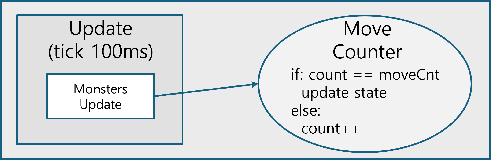
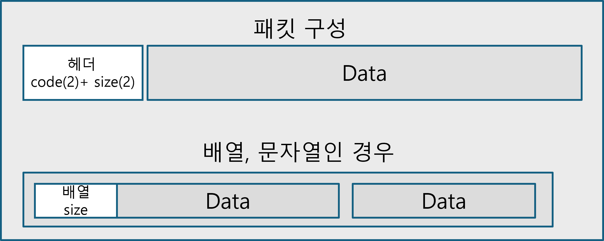

# Portfolio

## 중점적으로 개발한 내용입니다.

- <b>Windows와 Linux환경에 맞는 게임서버 개발에 관한 내용이 있습니다.</b>
- <b>클라이언트와 서버에서 물리충돌에 처리에 관한 내용이 있습니다.</b>
- <b>몬스터 상태에 따른 행동 및 클라이언트에서 동기화에 관한 내용이 있습니다.</b>
- <b>서버의 인게임에서 tick 처리에 관한 내용이 있습니다.</b>
- <b>캐릭터, 아이템등 수치를 코드가 아닌 관리하는 방법에 관한 내용이 있습니다.</b>
- <b>인벤토리와 같은 기능은 온라인게임을 참고하면서 순서를 생각하여 응용한 내용이 있습니다.</b>

### Contact

- github : https://github.com/qornwh
- mail : qornwh1@naver.com
- blog : https://hanarodeveloper.tistory.com/

## 보유기술

- 게임개발 : C++, C#, Unreal, VisualStudio, Rider
- 툴개발 : JavaScript, Node.js, VSCode

# 프로젝트

## Hunters & Creature

### 소개

해당 프로젝트는 3인칭 백뷰 방식의 MMORPG게임입니다. 이 게임에서는 원하는 캐릭터를 생성하고 몬스터를 사냥을 통해 성장시키는게 목표인 게임입니다. 
주요 내용은 다음과 같습니다.

1. 계정, 구매, 로그인등 인게임에 들어가기 전에 DB처리를 위한 node.js 웹서버 활용
2. 클라이언트에서 핵 또는 보안을 위해 공격 판단 처리를 서버에서 다시 검사
3. 데이터관리를 위한 json과 datatable사용해 아이템, 몬스터 수치를 컴파일 없이 바로 수정
4. 아이템(드롭, 인벤토리, 메일)등 유니크한 아이템과 적재할 수 있는 아이템의 생성 및 관리

- 기간 : 2024.07 ~ 현재
- 인원 : 1명 (서버 담당, 클라이언트 담당)
- 개발환경 : Windows
- 개발언어, 개발도구 : C++, Unreal, VisualStudio, Rider, JavaScript, Node.js
- 라이브러리 : Google::protobuf, nlohmann/json
- 플레이 영상 : 이미지 클릭 시 유튜브에서 재생됩니다.
   
  

### 1. 계정, 구매, 로그인등 인게임에 들어가기 전에 DB처리를 위한 node.js 웹서버 활용

- 먼저 웹서버를 활용한 이유는 게임서버가 인게임에서의 작업처리만 하게 되어 좀 더 빠른 응답과 효율성과 구매, 로그인등의 작업들은 웹서버에서만 따로 개발하기 때문에 문제가 발생 시 대응하기가 수월하기 때문입니다.
- 분리함으로써 api만 문서로 만들어두면 따로 서로 신경을 쓰지 않고 개발이 가능한 것이 장점입니다.
- 웹서버의 역할은 계정생성, 로그인, 캐릭터-무기 구매를 수행하고 결과 값으로 실패 시 result: 0, 성공 시 result: 1과 함께 필요한 데이터를 전달합니다.
- 웹서버는 express와 포매팅 prettier 모듈로 구성됩니다.

### 2. 클라이언트에서 핵 또는 보안을 위해 공격판단 처리를 서버에서 다시 검사

- 클라이언트는 충돌은 언리얼의 Collision은 사용하지 않았고, 2d로만 판정하면 되기에 서버와 거의 같은 로직을 사용합니다.
- 충돌 판정은 클라, 서버가 동일한 순서로 처리했습니다.
  1. 충돌체의 범위, AABB 경계상자의 안에 들어온 대상인지 확인합니다.
  2. OBB(원-원, 캡슐-원, 캡슐-캡슐)로 겹치면 충돌이 확정됩니다.
- 스킬옵션에 따라 단일 혹은 여러 대상, 근거리부터 계산 등은 클라에서 판단하고 충돌된 대상 정보만 서버로 전달해서 물리시뮬을 돌리는 방법으로 구성했습니다.

### 3. 서버의 인게임 프레임 업데이트(Tick)

- 서버의 인게임 tick은 언리얼에서 프레임마다 업데이트 시간을 의미합니다.
- 업데이트할 때, 몬스터의 이동, 공격, 히트, 사망, 스폰의 상태를 업데이트를 처리했습니다.
  - 몬스터의 상태는 서버의 tick 때마다 업데이트 되는 게 아닌, 상태를 카운터를 넣고 해당 카운터값이 되면 작동되도록 구성
- 모든 몬스터가 업데이트되면 상태, 좌표 등의 정보를 동기화 하기 위해 모든 클라이언트에 전달합니다.
- tick 동작 (일정 카운트 값이 되면 상태와 행동이 업데이트되는 방식)
   
  

### 4. 데이터관리를 위한 json과 datatable사용해 아이템, 몬스터 수치를 컴파일 없이 바로 수정

- 아이템의 능력치, 캐릭터의 기본 능력치들의 수치를 수정할 때 코드로 작성하게 되면 수정하면 다시 컴파일도 필요하고, 프로그래머가 아니면 수정이 힘들기 때문에 의존성이 없도록 구성됩니다.
- 서버의 경우 json 파싱을 위해 nlohmann/json라이브러리 사용했습니다.
- 언리얼의 경우는 datatable을 사용했습니다.

### 5. 장비 아이템의 생성 방법

- 장비 아이템의 경우 프로젝트 초반에 실수를 가장 많이 한 부분 중 하나입니다.
- 문제점
  - 아이템 키를 인벤토리 인덱스로 할당해 버리는 바람에 많은 아이템이 대체되고 누락되고 덮어쓰는 문제가 생겼습니다.
  - 장비 아이템의 경우는 n개씩 쌓이는 게 아닌 유니크하기 때문에 1개씩 따로 관리해야 하는 게 문제였습니다.
- 해결
  - 해당 문제를 해결하기 위해 C++의 UuidCreate함수로 uuid를 기반으로 장비 아이템의 unique key로 할당했습니다.
  - 장비 아이템과 다른 아이템은 따로 관리를 따로 처리했습니다.

### 6. 아이템 드롭

- 아이템 드롭 구성은 다음과 같습니다.
  - 서버에서 몬스터가 스폰될때 드롭할 아이템을 미리 정했습니다.
  - 몬스터를 처리할 때 아이템을 플레이어에게 바로 전달합니다, 단 인벤토리 칸이 모두 채워져 있을경우 남은 아이템은 메일로 전달됩니다.
  - 서버와 클라이언트 간의 아이템을 동기화 맞추기 위해 아이템을 획득한 아이템을 패킷으로 전달합니다.

### 7. 인벤토리

- 서버에서 플레이어의 인벤토리는 관리하기 쉽게 inventory클래스로 구현되어 있습니다.
  - 내부에 장비, 기타 아이템으로 관리되고, 장비된 아이템 또한 장비 소켓을 key로 unordered_map으로 관리했습니다.
- 클라이언트의 인벤토리 또한 서버처럼 inventory클래스로 구현되어 있습니다.
  - 실제 인게임 내에서 UMG로 보이는 인벤토리, 보내는 메일에서 인벤토리는 inventory객체를 참조하면서 아이템이 보이게 구현되어 있습니다.
- 인벤토리 기능은 플레이어가 처음 인게임에 들어올 때 동기화를 맞췄습니다.
  - 서버는 해당 플레이어의 인벤토리에 적재된 모든 아이템을 클라이언트에게 패킷으로 전달됩니다.
  - 클라이언트는 서버로부터 받은 패킷으로 inventory객체에 모든 아이템을 추가됩니다.
- 아이템 판매는 인벤토리 위치를 기반으로 서버 내의 아이템을 확인하면서 진행했습니다.

#### 7-1. 인벤토리 적재

- 실제 온라인게임에서 인벤토리에 획득, 우편으로 아이템이 적재되는 방식은 가장 최상위(top - left)에 적재됩니다.
- 해당 방법을 구현하기 위해 인벤토리의 빈공간을 n번 탐색보다는 우선순위큐로 관리하는 방식을 사용해서 관리했습니다.

### 8. 우편

- 우편기능에서 중요하게 생각한 부분은 아이템을 첨부하는 소켓입니다. 게임 내에서 플레이어뿐만 아니라 이벤트를 통해서 운영자가 우편으로 아이템 및 재화를 전달해주는 경우가 많기 때문입니다.
- 우편은 2개의 소켓과 소켓의 타입(장비, 기타)가 추가로 있고, 게임머니, 우편 내용(텍스트)로 구성했습니다.
- 우편을 보낼 때 우편에 해당하는 우편코드는 우편정보를 db insert할 때 OUTPUT으로 받아옵니다.
- 우편코드를 통해서 어떤 우편이 읽어진 상태, 어떤 재화를 받은 상태인지 확인됩니다.
- 클라이언트에서는 초기에 한번 우편함이 갱신되고 이후는 새로고침, 삭제 시 갱신됩니다.

### 9. 추가적인 개발 내용

- 언리얼에서 내부에 Google::protobuf가 있지만, 버전이 다르기 때문에 따로 사용하는 버전을 모듈화 시켰습니다.
- Google::protobuf가 unicode즉 한글을 바로 write하는 함수가 c#에는 바로 가능했는데 c++에서는 string만 지원되므로 따로 wchar(2byte) <-> char(1byte) 간의 변환을 통해 해결했습니다.

server : https://github.com/qornwh/MMO_GameServer
 
client : https://github.com/qornwh/MMO_GameClient

## Hunters Online

### 소개

해당 프로젝트는 탑뷰방식의 MMORPG게임입니다. 이 게임에서는 캐릭터를 생성하고, 각종스킬을 사용하고, 몬스터, 보스몬스터를 처치하는 게임입니다. 
주요내용은 보스몬스터, 서버 물리 처리, Google::protobuf이용한 패킷 처리, iocp서버 통신입니다.

- 기간 : 2023.12 ~ 2024.05
- 인원 : 2명 (서버 담당, 클라이언트 네트워크 코드 담당)
- 개발환경 : Windows
- 개발언어, 개발도구 : C++, C#, Unity, Rider
- 라이브러리 : Google::protobuf, Boost::Json
- 플레이 영상 : 이미지 클릭 시 유튜브에서 재생됩니다.
   
  

### 1. 서버 동작(IOCP)

- 서버의 동작은 멀티스레드의 모든 스레드에서 다음과 같이 동작합니다.
  - 초기 메인 스레드만 있을때 서버소켓을 초기화(bind, iocp handler에 등록, listen), 비동기로 일정 수 만큼 overlapped를 accept합니다.
  - GQCS를 함수를 사용해서 응답 처리된 overlapped에서 처리되는 타입을 보고 connect, read, write 처리됩니다.
    - accept일 때 해당 처리 및 비동기로 read를 등록
    - read일 때 패킷을 파싱후 비동기로 read를 등록
    - write는 패킷을 송신
  - 해당 작업들은 멀티스레드 내에서 작동되므로 shared_mutex를 이용해서 lock을 사용합니다.
    - read, write가 있는데 raii패턴처럼 객체가 할당될 때 lock이 되고 해제될 때 lock이 해제되도록 구성

### 2. Google::protobuf 이용한 패킷 처리

- [첫 번째 프로젝트](#mmorpg-simulation)에서는 따로 라이브러리를 사용하지 않고 패킷을 구현했지만, 생각보다 문제가 좀 있었습니다.
  - 패킷의 개수가 늘어날수록 패킷을 정의한 struct가 순서도 중요하고 클라이언트와 서버에서의 패킷을 정의한 struct를 따로 맞춰야 하는 문제가 있었습니다.
  - 패킷을 정의한 struct가 늘어나면서 추가하지 않은 자료형, struct내에서 또 struct, array 등을 구성하니 코드를 작성하면서 에러율이 높아졌습니다.
- Google::protobuf를 사용해서 장점은 다음과 같습니다.
  - .proto파일을 기반으로 패킷의 struct를 생성
  - 호환이 된다면 다른 언어라도 proto파일 기반으로 generate가 가능함으로써 직접 작성할 필요가 없음
- [패킷의 헤더 구성은 첫 번째 프로젝트와 동일합니다.](#5-클라이언트-네트워크-처리)

### 3. 게임룸(몬스터 상태 변화, 물리충돌)

- 게임룸의 역할
  - 게임룸을 담당하는 클래스는 100ms에 한 번씩 업데이트되도록 처리했습니다.
    - 게임룸에 존재하는 몬스터, 플레이어 업데이트
  - 게임룸의 IOCP handler에 게임룸 내에서 처리될 함수를 등록해서 동기적으로 한 번씩 처리되도록 하였습니다.
    - 입장, 퇴장, 공격 동기화가 필요한 부분
- 몬스터의 동작
  - 게임룸이 업데이트될 때 몬스터의 상태(스폰, 이동, 공격)가 업데이트됩니다.
  - 보스몬스터의 경우 hp가 일정 이하로 감소하면 queue에 스킬을 넣고 업데이트될 때 발생되도록 처리했습니다.
  - 몬스터가 최초에 스폰될 때 드롭될 아이템이 지정됩니다.
- 물리충돌은 먼저 AABB로 경계상자로 판단 후에 OBB(원, 사각형)으로 충돌을 판정했습니다.
  - 충돌기준은 원-원, 원-사각형, 사각형-사각형 3가지입니다.
  - 충돌은 정적라이브러리인 'GameEngine' 이름의 프로젝트로 따로 만들어서 관리가 쉽도록 구성했습니다.

### 4. 계정 및 로그인 DB 처리

- DB는 쿼리 요청할 때마다 커넥션을 하면 비용이 많이 들기 때문에 풀링으로 처리했습니다.
- DB에서 사용하는 자료형 int, bool, char등 bind, param함수를 만들어서 사용하기 쉽게 구성했습니다.
- 계정 생성, 로그인, 인벤토리의 DB요청은 SessionDB, InventoryDB등 가시성이 높게 관련 내용을 묶어서 클래스화 하였고, 클래스 생성될 때 커넥션을 가져오고 스택메모리에서 소멸할 때 커넥션이 풀링에 다시 push되는 방향으로 구성했습니다.

### 5. 클라이언트 네트워크 처리

- 네트워크 통신 부분은 C#에서 지원하는 비동기 관련(ConnectAsync, BeginReceive, BeginSend)함수에 콜백을 등록해서 이용했습니다.
- 패킷처리는 protobuf버전을 서버와 클라버전을 동일하게 맞춰주었고, 같은 .proto파일을 사용해서 에러를 최소화했습니다.
- 패킷의 코드로 분기는 protobuf의 enum을 사용했고, 실제 게임에 사용되는 공격, 채팅, 인벤 등은 델리게이트를 사용했습니다.
- 네트워크 동작방식은 다음과 같습니다.
  - 최초 한번 Manager클래스에서 socket을 초기화
  - 서버와 연결을 시키고 read를 비동기기 콜백으로 등록
  - 게임씬에서 Manager클래스에서 socket을 참조로 가져와서 socket컴포넌트를 생성
  - 이후 네트워크 통신 시작

server : https://github.com/qornwh/GameServerProject
 
client : https://github.com/Theta08/RpgProject

## MMORPG Simulation

### 소개

해당 프로젝트는 MORPG, MMORPG게임들의 서버-클라이언트 구조로 시뮬레이션만 심플하게 제작되었습니다. 
주요 내용은 Epoll 서버 통신, 패킷 구성, 서버-클라이언트 간의 유닛 시뮬레이션입니다.

- 기간 : 2023.11 ~ 2024.03
- 인원 : 1명 (서버 담당, 클라이언트 담당)
- 개발환경 : Linux, Windows
- 개발언어, 개발도구 : C++(Epoll), Unreal, VSCode
- 플레이 영상 : 이미지 클릭 시 유튜브에서 재생됩니다.
   
  

### 1. 리눅스 서버(Epoll) 이용

- 가장 먼저 리눅스로 게임서버를 개발을 선택한 이유는 궁금했고, 혹시나 모를 윈도우에서 -> 리눅스 간의 포팅작업도 있을 수 있기 때문입니다.
- Epoll 통신 진행입니다.
  - epoll_wait함수로 Epoll에 등록된 fd(소켓/파일디스크립터)리스트를 배열로 전달한다. 리턴값은 발생된 fd의 개수이다.
  - 발생된 fd가 서버소켓의 파일디스크립터가 같으면 클라이언트 소켓을 accept한다.
  - 발생된 fd가 등록된 클라이언트소켓의 파일디스크립터이면 read처리를 하고 읽어온 게 0이면 disconnect를 한다.
- Epoll 통신 진행 중 발생된 가장 큰 문제입니다.
  - 이 프로젝트에서 가장 큰 이슈였고 가장 예상하지 못한 문제는 fd의 변경 감지(Accpet, Recive)가 될 때 발생됩니다.
  - Epoll의 변경감지는 몇 개가 발생하는지를 알려주지 멀티스레드에서는 thread-safe하지 못하는 구조인 걸 알았습니다.
- 해결방법
  - Epoll은 'epoll_wait'함수로 몇 개가 발생했는지 확인하여 개수만큼 루프를 돌리면서 소켓을 처리하기 때문에 thread-safe를 보장하는 게 아니므로 'atomic'으로 락프리를 만들어 해결했습니다.
- 정적 라이브러리, 빌드를 위한 MakeFile을 이용해서 빌드구성을 처리했습니다. 폴더구성은 아래처럼 나뉘었습니다.
  - CoreLib폴더에는 server, session, Epoll, lock, tls등 네트워크와 스레드에 필요한 클래스로 구성되어 있습니다.
  - GameBS폴더에는 main, room, player등 실제 게임서버에 필요한 클래스로 구성되어 있습니다.
  - CoreLib폴더내의 MakeFile은 CoreLib폴더부터 정적라이브러리로 묶고, 그 후 MakeFile로 GameBS를 빌드하면서 CoreLib라이브러리를 추가해서 빌드시켰습니다.
    - 이렇게 한 이유는 CoreLib와 관련된 코드는 미리 개발하고 수정이 적기 때문에 GameBS만 빌드해서 속도를 높이기 위함입니다.

### 2. 서버-클라이언트 간의 통신할 때의 패킷 구성

- 패킷 => 헤더(code 2바이트 + size 2바이트 => 4바이트) + 데이터로 구성했습니다.
- 배열과 문자열을 처리하기 위해서 size+내용을 한 쌍으로 구현했습니다.
- 패킷 파싱 진행입니다.
  - 패킷은 헤더 구간부터 확인합니다.
  - 헤더의 size만큼 패킷이 존재할 때 파싱을 진행합니다.
  - 헤더의 코드에 맞는 패킷을 읽어내면서 읽는 위치를 데이터 타입만큼 position을 증가하면서 진행합니다.
  - 배열이나 문자열인 경우 읽는 위치를 'size'만큼 position을 증가하면서 진행합니다.
     
    

### 3. 플레이어, 몬스터 시뮬레이션

- 실시간으로 플레이어들이 움직인 포지션를 각각 클라이언트에 오차가 적을 정도로 보여주기 위해서 0.2초마다 패킷을 넘기면서 처리했습니다.
  - 초기에는 2초에 한 번씩 보내본 결과 여러 클라이언트에서 포지션이 2초만큼의 거리차이가 있는 걸 확인했습니다.
  - 왜 0.2초인가, 사실 1초에 프레임마다 보낼 때가 가장 이상적이지만 한 공간에 100명 정도 들어오는 걸 목표로 잡았기 때문에 0.2초 정도로 눈으로 확인이 제대로 안 될 정도로 잡았고, 패킷량은 초당 서버 수신 시 약 4k((4 + 4) \* 100 \* 5)정도 이기 때문에 적용하였습니다.
  - 클라이언트 PC에서 네트워크에서 지연이 생길 때, 0.2초 이상의 거리가 생기면 속도를 좀 빠르게 처리하는 것으로 보정하였습니다.
- 몬스터의 행동은 0.5초마다 이동, 타겟으로 이동, 공격을 결정했습니다.
  - 이동 : rand함수를 사용해서 랜덤한 방향으로 이동
  - 타겟으로 이동 : 플레이어에게 공격받으면 그 플레이어로 방향을 바꿔서 이동
  - 공격 : 타겟과 몬스터의 거리가 공격 가능 거리이면 공격
- 플레이어, 몬스터 공격 충돌처리는 언리얼 엔진에서 콜리전을 사용해서 결과 값을 서버로 전달했습니다.

### 4. 언리얼 클라이언트

- 플레이어 클래스 : 나의 플레이어와 다른 플레이어는 클래스를 나누어서 처리
- 공격, 데미지 : 각각 액터클래스기반으로 구현
- 애니메이션 : 애니메이션 몽타주와 블렌드 스페이스 사용
- 네트워크 : socket처리하는 액터로 구현, socket액터를 게임모드에 배치해서 네트워크 통신
- 리소스 : 캐릭터 메시, 애니메이션등은 게임인스턴스에서 한 번만 로드
- 게임화면 : ui화면, 로그인화면은 umg로 구성

server : https://github.com/qornwh/BSGameServer
 
client : https://github.com/qornwh/BSGameClientUE5
