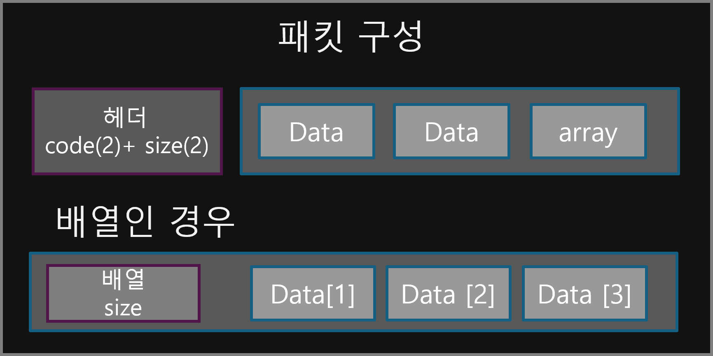

# Portfolio

## 중점적으로 다룬 내용입니다.

- <b>클라이언트와 서버에서 물리충돌에 처리</b>
- <b>몬스터 상태에 따른 행동 및 클라이언트에서 동기화</b>
- <b>서버의 인게임에서 tick 처리</b>
- <b>캐릭터, 아이템등 수치를 코드가 아닌 관리하는 방법</b>
- <b>인벤토리와 같은 기능은 온라인게임을 참고하면서 순서를 생각하여 응용</b>
- <b>Windows와 Linux환경에 맞는 게임서버 개발</b>

## 사용 언어, 툴

- 게임개발 : C++, C#, Unreal, VisualStudio, Rider
- 툴개발 : JavaScript, Node.js, VSCode

## 1. Hunters & Creature 프로젝트

### 소개

- 기간 : 2024.07 ~ 현재
- 인원 : 1명 (서버 담당(C++), 클라이언트(ue5) 담당)
- 라이브러리 : Google::protobuf, nlohmann/json
- 해당 프로젝트는 3인칭 백뷰 방식의 MMORPG게임입니다. 이 게임에서는 원하는 캐릭터를 생성하고 몬스터를 사냥을 통해 성장시키는게 목표인 게임입니다.
  <br>
  [](https://youtu.be/Z_v4MGjklCA)

## 게임 구성도

### ```인게임 서버 + api 서버 + 클라이언트 + config설정파일```로 구성했습니다.

> ```인게임 + api서버``` 분리한 이유는 다음과 같습니다.
> - 로그인, 결제등은 인증처리에서 **처리 대기 시간 때문에 분리해서 처리하면 성능상 이점**을 가지고 **중요한건 해당 작업중에 게임을 하지 않기** 때문입니다.

> 캐릭터, 아이템, 스킬등 정보를 ```config.json, dataTable 분리한``` 이유는 다음과 같습니다.
> - 아이템, 캐릭터, 스킬등의 수치를 수정할 때 코드로 작성하게 되면 수정하면 다시 컴파일도 필요하고, 프로그래머가 아니면 수정이 힘들고 의존성때문에 분리했습니다.


### 게임서버의 ```게임 룸과 프레임```처리

> 게임 룸(하나의 공간에서 일어나는 물리, 접속등 모든 클라에게 쏴야 되는 정보) 처리 방법
>   - 플레이어의 공격, 접속, 퇴장등 멀티스레드에 구애받지 않고 작업하기 위해 저는 ```IOCP```를 이용했습니다.
>   - IOCP를 사용한 이유는 ```lock-free를 이용해 atomic을 사용한 방법보다, 커널영역에서 동기화 맞추면서 push가 되고 성능상 이점이 있기 때문에 사용했습니다.```

> 게임 프레임(일정 간격에 발생되는 몬스터 상태 업데이트) 처리 방법
>   - 일정 시간마다 프레임을 업데이트 하기 위해 ```게임 룸```이 사용하는 IOCP에 업데이트를 넣었습니다. 이중으로 관리해서 lock거는것 보다 해당 방법이 좀더 lock호출이 적게 나가기 때문에 이런 방식을 선택했습니다.


<details>
<summary>코드 참고 </summary>

```cpp 
// isLoopTask 변수로 CAS연산으로 동기화를 맞춰주고 일정 시간이 되면 PQCS로 IOCP에 작업을 추가하는 방향으로 구현했습니다.
bool curLoopTask = isLoopTask.load();
if (!curLoopTask && isLoopTask.compare_exchange_strong(curLoopTask, true))
{
    std::chrono::system_clock::time_point current = std::chrono::system_clock::now();
    std::chrono::duration<double> sec = current - _timer;
    if (std::chrono::duration_cast<std::chrono::milliseconds>(sec).count() >= _timerDelay)
    {
        DWORD dwNumberOfBytesTransferred = 0;
        ULONG_PTR dwCompletionKey = _taskId.fetch_add(1);
        OverlappedTask* overlapped = new OverlappedTask();
        overlapped->f = [this] { Update(); };
        _timer = current;
        PostQueuedCompletionStatus(_taskIo, dwNumberOfBytesTransferred, dwCompletionKey, reinterpret_cast<LPOVERLAPPED>(overlapped));
    }
    isLoopTask.exchange(false);
}
```
</details>

[코드 링크](https://github.com/qornwh/MMO_GameServer/blob/3acd40c6e4ade068c25ba4074ea8e71f7f6e29f4/GameServer/IRoom.cpp#L169)

### 서버의 물리처리

> 모든 클라이언트에서 ```실시간으로 플레이어들과 몬스터들이 움직인 방법```
>   - 클라이언트에서는 ```0.2초마다 위치를 서버로 전달```
>   - 몬스터는 ```게임 프레임에서 이동상태인 경우``` 움직이는 방향으로 구현했습니다.

> 서버에서 공격판정을 한번 더 처리한 이유는 다음과 같습니다.
>   - 클라이언트에서 공격판정에 대한 ```변조```를 막기 위해 ```서버에서 공격판정을 한번 더 처리했습니다```.


<details>
<summary>서버의 공격판단에 대한 문제와 해결</summary>

> 서버에서 공격판단을 구현하기까지의 문제 해결방법 입니다.
> - 서버에서도 공격판단을 위한, 충돌체를 구현할 필요가 있다.
>   - ```충돌체(총알)을 2차원의 캡슐, 구의 형태```로 구현을 했고, ```AABB로 확인후 OBB로 공격판단```을 내렸다.
> - 꼭 3차원에서 충돌판정을 내야 하는가?
>   - 인게임내의 ```맵의 공간이 1층으로 구성```, 점프는 없으므로 ```꼭 3차원을 생각할 필요는 없었다```.
>   - 추가적으로 3차원이라면 짐벌락 문제와 쿼터니언 구현및 계산량 자체가 많아진다.
> - 공격판단시 ```어떤 공격```인지 전체적인 정보가 필요 한가?
>   - 충돌체를 구현함으로써 실제로 패킷에는 ```충돌체의 ID값이``` 패킷으로 넘겨지게된다.
>   - 이로 인해 ```스킬 코드, 몇번째의 총알인지등의 정보가``` 필요없어지게 되었다.
>   - 결론은 위치, ID값으로만 어떤 충돌체인지 Map으로 관리가 되어 패킷량의 감소도 가져오게 된다.

[서버 충돌판정 코드 링크](https://github.com/qornwh/MMO_GameServer/blob/3acd40c6e4ade068c25ba4074ea8e71f7f6e29f4/GameEngine/Collider.h#L9)

</details>

## 게임 컨텐츠

### 인벤토리, 우편 관리

> 인벤토리 - 위치, 장비아이템 - 유니크ID, 우편 - 우편ID를 기준으로 구조를 만들었습니다.
> - 인벤토리 ```각각 위치가 아이템이 담길 소켓이고```, 이 위치를 기준으로 판매, 획득, 첨부가 되는 방식으로 구현했습니다.
> - 우편은 ```각 소켓번호```와 ```아이템타입```에 대한 정보를 기준으로 수령, 삭제가 가능한 방식으로 구현했습니다.

<details>
<summary>인벤토리와 유니크 키 문제해결및 구현 방법</summary>

> 인벤토리를 구현하기까지의 문제 해결방법 입니다.
> - ```장비아이템은 유니크 해야 된다.```
>   - 초기에는 생각없이 ```아이템 코드로 관리하다보니 모두 n개씩 쌓이는 문제```가 발생했습니다.
>   - 이걸 해결하기 위해 유니크한 ID값이 필요하니, DB에서 1씩 증가 or UUID 생성?보다는 c++ 자체에서 제공되는 UUID생성 함수를 통해 처리하는게 깔끔해 보여 해당 방식으로 해결했습니다. 
> - ```인벤토리의 위치(소켓)또한 유니크 해야 된다.```
>   - 초기에는 인벤토리의 ```아이템 판매, 드랍 획득시 적재를 array에 순서대로 하여 문제(적재가 안되는 현상과 array에 듬성듬성 쌓임)```가 발생했습니다.
>   - 해당 결과를 통해 인벤토리의 ```위치는 유니크한 값```이고, ```인벤토리의 위치를 기준```으로 판매, 우편 전송, 획득이 안되었던 문제들을 해결했습니다.

</details>

[인벤토리, 우편 추가 내용 링크]()

## 언리얼의 클라이언트 개발시 효율적인 메모리 관리를 위해 smart_ptr사용

> RPG 게임의 특성은 캐릭터 능력치, 인벤토리, 아이템, 스킬등 여러가지 기능들은 굳이 액터를 상속받아서 메모리를 또 올려야 되는지 고민했습니다.
> 이를 해결하기 저는 서버에서 사용했던 ```smart_ptr```을 사용해서 메모리 해제의 이점과 액터를 만들어 메모리에 대한 이점도 챙기게 되었습니다.
> 캐릭터 능력치, 인벤토리, 우편등을 ui클래스, Actor와 분리해서 GameInstance, GameInstance에서 받아오도록 구현했습니다. 

[클라이언트 추가 내용 링크]()

## 인게임 서버의 부담을 줄이기 위하 웹 api 서버 구현

[웹 api 서버 구현 링크]()

## DB 테이블 구조

[DB 테이블 구조 링크]()

server : https://github.com/qornwh/MMO_GameServer
<br>
client : https://github.com/qornwh/MMO_GameClient

---

## Hunters Online

### 소개

- 기간 : 2023.12 ~ 2024.05
- 인원 : 2명 (서버 담당(c++), 클라이언트(Unity) 네트워크 코드 담당)
- 개발환경 : Windows
- 라이브러리 : Google::protobuf, Boost::Json
- 해당 프로젝트는 탑뷰방식의 MMORPG게임입니다.
- server 코드 : https://github.com/qornwh/GameServerProject
- client 코드 : https://github.com/Theta08/RpgProject
  <br>
  [](https://youtu.be/bkWg1QWX7Vs)

### 1. 서버 동작(IOCP)

> 서버의 동작은 멀티스레드의 ```모든 스레드```에서 다음과 같이 동작합니다.
> - ```초기에 한번 서버소켓을 초기화```(bind, iocp handler에 등록, listen), 비동기로 일정 수 만큼 overlapped를 accept합니다.
> - GQCS를 함수를 사용해서 응답 처리된 overlapped에서 처리되는 타입에 맞게 connect, read, write 처리됩니다.
>   - ```accept```일 때 해당 처리 및 비동기로 read를 등록
>   - ```read```일 때 패킷을 파싱후 비동기로 read를 등록
>   - ```write```는 패킷을 송신
> - 해당 작업들은 멀티스레드 내에서 작동되므로 shared_mutex를 이용해서 lock을 사용합니다.
>   - read, write될때 ```raii패턴처럼 객체가 할당될 때 lock이 되고 해제될 때 lock이 해제```되도록 구성

### 2. Google::protobuf 이용한 패킷 처리

> [첫 번째 프로젝트](#mmorpg-simulation)에서는 ```따로 라이브러리를 사용하지 않고 패킷을 구현했지만, 생각보다 문제```가 있었습니다.
> - 하나의 패킷의 구성정보의 ```순서도 중요```하고 클라이언트와 서버에서의 ```패킷 구성 코드를 따로 맞춰야 하는 문제```가 있었습니다.
> - 결국은 ```패킷을 정의한 개수가 늘어나면서``` 추가하지 않은 자료형, struct내에서 또 struct, array 등을 구성하고 코드를 작성하면서 ```에러율```이 높아졌습니다.

> 대체방법으로 ```Google::protobuf```를 사용한 장점
> - .proto파일을 기반으로 ```패킷의 코드 생성```
> - 호환이 된다면 ```다른 언어```라도 proto파일 기반으로 generate가 가능함으로써 ```직접 코드를 작성할 필요가 없음```
> [패킷의 헤더 구성은 첫 번째 프로젝트와 동일합니다.](#5-클라이언트-네트워크-처리)

### 3. DB 처리

> DB처리 주요 구현 
> 1. DB는 쿼리 요청할 때마다 ```커넥션을 하면 비용```이 많이 들기 때문에 ```풀링```으로 처리했습니다.
> 2. DB에서 사용하는 ```자료형``` int, bool, char등 bind, param함수를 ```래핑```해서 사용하기 쉽게 구성했습니다.
> 3. 로그인, 아이템등 각 역할의 ```~~~DB로 클래스```로 만들었고 ```raii```패턴으로 DB커넥션풀에서 DB커넥션을 가져오는 방식으로 구현했습니다.

### 4. 클라이언트 네트워크 처리

> 네트워크 통신 부분은 C#에서 지원하는 ```비동기 관련(ConnectAsync, BeginReceive, BeginSend)을``` 사용했습니다.

> ```클라이언트 네트워크 동작구조```는 다음과 같습니다.
> 1. 서버와 연결이 되면 ```BeginReceive미리 콜백을 등록```한다.
> 2. BeginReceive의 콜백함수에서 받아온 ```패킷을 queue에 push```한다.
> 3. ```게임 프레임이 업데이트``` 될때 queue에서 모든 패킷을 pop해서 처리한다.

## MMORPG Simulation

### 소개

- 기간 : 2023.11 ~ 2024.03
- 인원 : 1명 (서버 담당, 클라이언트 담당)
- 개발환경 : Linux, Windows
- 개발언어, 개발도구 : C++(Epoll), Unreal, VSCode
- 해당 프로젝트는 MORPG, MMORPG게임들의 서버-클라이언트 구조로 시뮬레이션만 심플하게 제작되었습니다.
- server 코드 : https://github.com/qornwh/BSGameServer
- client 코드 : https://github.com/qornwh/BSGameClientUE5
  <br>
  [](https://youtu.be/NIEy5bpEhBk)

### 1. 리눅스 서버(Epoll) 이용

> 리눅스로 게임서버를 개발을 선택한 이유는 궁금했고, 혹시나 모를 윈도우에서 -> 리눅스 간의 포팅작업도 있을 수 있기 때문입니다.


<details>
<summary>Epoll 통신 진행 중 발생된 문제및 해결</summary>

> 이 프로젝트에서 진행중중 예상하지 못한 문제는 ```fd의 변경 감지(Accpet, Recive)```가 될 때 입니다.
> - 멀티스레드에서 작업하다 보니 더미 클라이언트로부터 연속적인 패킷을 받을때,
> - Epoll의 epoll_wait 변경감지된 fd는 ```thread-safe하지 못하는 구조```인 걸 여러번 테스트후 알았습니다.
> - 결론적으로 해결방법은 다음과 같습니다.
>   - Epoll은 'epoll_wait'함수를 사용할때, ```thread-safe를 보장하기 위해 'atomic'으로 lock-free```를 만들어 해결했습니다.

</details>
<br>
<details>
<summary>리눅스용 빌드</summary>

> 빌드 구성 ```CoreLib폴더-정적라이브러리(네트워크), GameBS폴더(인게임)을 나눠서 구성```했습니다.
> - CoreLib폴더내의 MakeFile은 ```CoreLib폴더부터 정적라이브러리로 묶고```, 그 후 MakeFile로 GameBS를 빌드하면서 ```CoreLib라이브러리를 추가```해서 빌드시켰습니다.
>   - 이렇게 한 이유는 CoreLib와 관련된 코드는 ```미리 개발하고 수정이 적기 때문에``` GameBS만 빌드해서 ```개발속도```를 높이기 위함입니다.
</details>

### 2. 서버-클라이언트 간의 통신할 때의 패킷 구성

> 패킷 => 헤더(code 2바이트 + size 2바이트 => 4바이트) + 데이터로 구성했습니다.
> 배열과 문자열을 처리하기 위해서 size+내용을 한 쌍으로 구현했습니다.
<br>


> 패킷 파싱 진행입니다.
>> 패킷은 ```헤더 길이 체크``` => 헤더의 4바이트 만큼 패킷이 존재할 때 파싱을 진행합니다.<br>
>> ```헤더의 코드```에 맞는 패킷을 읽어내면서 읽는 위치를 데이터 타입만큼 position을 증가하면서 진행합니다.<br>
>> ```배열이나 문자열```인 경우 읽는 위치를 'size'만큼 position을 증가하면서 진행합니다.<br>

<details>
<summary>언리얼 클라이언트 구성</summary>

> 플레이어 : 나의 플레이어와 다른 플레이어는 클래스를 나누어서 처리<br>
> 공격, 데미지 : 각각 액터클래스기반으로 구현 <br>
> 애니메이션 : 애니메이션 몽타주와 블렌드 스페이스 사용 <br>
> 네트워크 : ```socket처리하는 액터로 구현```, ```socket액터를 게임모드에 배치```해서 네트워크 통신 처리 <br>
> 리소스 : 캐릭터 메시, 애니메이션등은 게임인스턴스에서 ```한 번만 로드``` <br>
> 게임화면 : ui화면, 로그인화면은 umg로 구성 <br>
</details>
