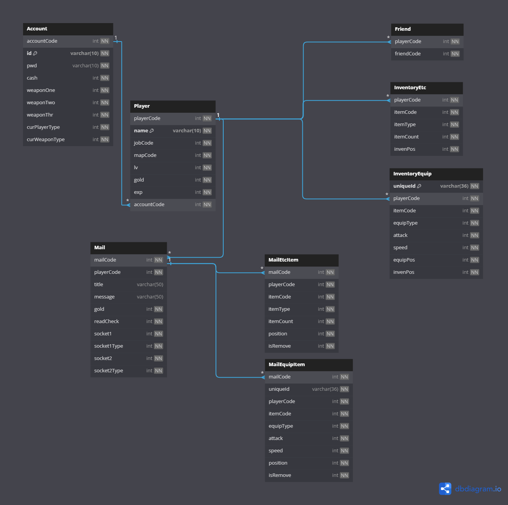

# DB 테이블 구조 및 커넥션

- 계정, 캐릭터, 아이템, 메일에 대한 관계를 구성했습니다
- db에 대한 커넥션을 효율적으로 사용하고 자료형에 따른 param, bind등의 함수를 한번 래핑했습니다.

## 테이블 구조

- 계정 -> 캐릭터 -> 인벤토리/우편/친구로 구성되어 있습니다.
- 계정의 경우 수정이 적고 탐색이 많기 때문에 빠른 탐색을 위해 인덱스를 적용했습니다.
- InventoryEquip, MailEquipItem의 uniqueId가 UUID입니다.



## DB 커넥션

### DB 커넥션 풀링

- 커넥션클래스는 shared_ptr로 만들었고, 레퍼런스 카운트가 사용되지 않을때 다시 풀링 안에 들어가는 방식으로 구현했습니다.
  - [사용 코드 링크](https://github.com/qornwh/MMO_GameServer/blob/3acd40c6e4ade068c25ba4074ea8e71f7f6e29f4/CoreLibIOCP/DBConnectPool.cpp#L39)

- DB 커넥션을 사용하는 객체에서는 ```생성자에서 커넥션을 pop하고``` ```소멸자에서 레퍼런스 카운트가 0이``` 되므로 자동적으로 ```다시 풀링 안에 들어가는``` 구조로 구현했습니다.

### bindParam, bindCol함수 래핑

- int, char, wchar등 많이 사용하는 자료구조에 맞춰서 모든 함수들은 한번 래핑작업을 했습니다.
  - ```래핑작업```을 한 이유는 각 자료구조 타입마다 파라미터가 다르므로, 각 함수에 ```가독성```을 높이기 위함입니다.
  - [사용 코드 링크](https://github.com/qornwh/MMO_GameServer/blob/3acd40c6e4ade068c25ba4074ea8e71f7f6e29f4/CoreLibIOCP/DBOdbc.cpp#L19)

```cpp
// 사용 예시 입니다.
void DBOdbc::BindParamChar(SQLULEN len, SQLPOINTER value)
{
	_conn->BindParameter(_paramIdx, SQL_PARAM_INPUT, SQL_C_CHAR, SQL_VARCHAR, len, 0, value, 0, nullptr);
	_paramIdx++;
}

void DBOdbc::BindParamWchar(SQLULEN len, SQLPOINTER value)
{
	_conn->BindParameter(_paramIdx, SQL_PARAM_INPUT, SQL_C_WCHAR, SQL_WVARCHAR, len, 0, value, 0, nullptr);
	_paramIdx++;
}
```