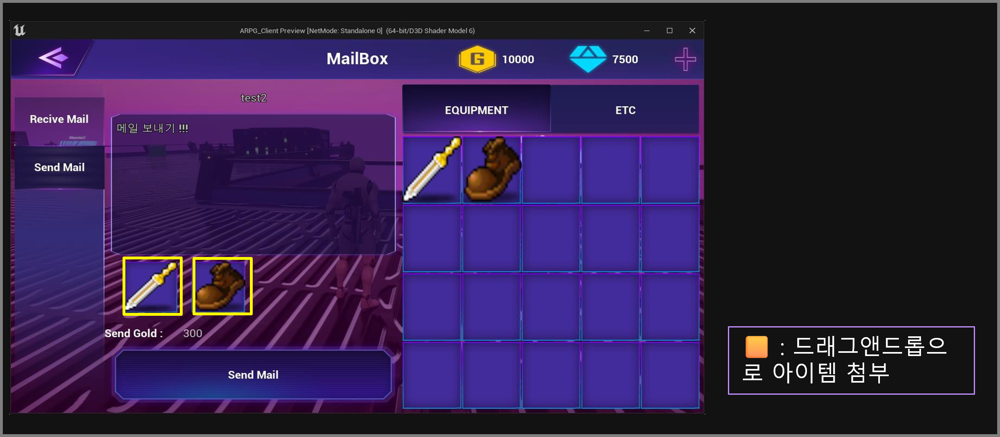

# 인벤토리와 우편

## 인벤토리

### 서버에서는 ```아이템 드롭, 우편에서 아이템 수령, 아이템 장착, 판매``` 작업들을 처리합니다.

- 아이템 드롭, 우편 수령 => 몬스터에 드롭 아이템을 바로 인벤토리에 ``적재``하는 방식으로 구현했습니다.
```cpp
EquipItem& Inventory::AddItemEquip(EquipItem& equip)
{
    WriteLockGuard writeLock(lock);
    // 드롭및 수령받을때
    if (_emptyEquipInvenList.size() > 0)
    {
        int position = _emptyEquipInvenList.top();
        _emptyEquipInvenList.pop();
        equip._invenPos = position;
        _inventoryEquipItemList[position] = equip;
    }
    return equip;
}
```

- 아이템 장착 => ```장비 소켓```을 따로 만들어두고 장비소켓과 인벤토리의 아이템을 ``교체``하는 방식으로 구현했습니다다.
```cpp
bool Inventory::ItemEquipped(int32& invenPos, int32& equipPos)
{
    WriteLockGuard writeLock(lock);

    if (invenPos < 0)
      ...

    EquipItem& invenItem = _inventoryEquipItemList[invenPos];
    EquipItem& equipItem = _equippedItemList[equipPos];

    if (invenItem.IsEmpty() && equipItem.IsEmpty())
        return false;

    if (equipItem.IsEmpty())
       _emptyEquipInvenList.push(invenPos);

    EquipItem tempItem = invenItem;
    invenItem = equipItem;
    equipItem = tempItem;
    if (!invenItem.IsEmpty())
    {
        invenItem._invenPos = invenPos;
        invenItem._equipPos = -1;
    }
    if (!equipItem.IsEmpty())
    {
        equipItem._invenPos = -1;
        equipItem._equipPos = equipPos;
    }
    return true;
}
```

- 판매 => 인벤토리의 ```위치를 기준```으로 아이템을 확인하며 판매되는 방법입니다.

```cpp
bool Inventory::UseItemEquip(int32 invenPos)
{
    WriteLockGuard writeLock(lock);
    if (CheckItemEquip(invenPos))
    {
        EquipItem& item = _inventoryEquipItemList[invenPos];
        _emptyEquipInvenList.emplace(invenPos);
        item = EquipItem::EmptyEquipItem();
        return true;
    }
    return false;
}
```

### 클라이언트에서 인벤토리 관리

- 인벤토리 객체는 GameInstance에서 변수로 관리를 했습니다. 해당 객체가 업데이트 되면 인벤토리UI도 업데이트 되는 방식입니다.
- 아래코드에서 ```GameInstance에서 인벤토리 객체를 참조하고```, 해당 위치```slot에 아이템 이미지가 업데이트 되는 방식입니다```.
```cpp
// UBJS_ItemSlotWidget == slot

void UBJS_InventoryWidget::UpdateEquipSlot(int32 InvenPos)
{
	auto instance = Cast<UBJS_GameInstance>(GetGameInstance());
	if (instance)
	{
		auto& item = instance->GetMyInventory()->GetInventoryEquipItemList()[InvenPos];
		if (!item.IsEmpty())
		{
			auto& ImageMap = instance->GetItemEquipIconImgMap();
			auto slot = EquipSlot[InvenPos];
			slot->SetEquip(item);
			slot->SetSlots(true);
			slot->SetImg(ImageMap[item.ItemCode]);
		}
		else
		{
			RemoveEquipSlot(InvenPos);
		}
	}
}
```


### 우편

언리얼에서 ```드래그앤 드롭```기능을 사용하기 위해 커스텀 버튼을 만들어주었습니다.

```cpp
DECLARE_DYNAMIC_MULTICAST_DELEGATE(FOnRightClick);
DECLARE_DYNAMIC_MULTICAST_DELEGATE(FOnDoubleClick);

UCLASS()
class ARPG_CLIENT_API UCustomButton : public UUserWidget
{
	...
	// 델리게이트 프로퍼티 선언
	UPROPERTY(BlueprintAssignable, Category = "Mouse Events")
	FOnRightClick OnRightClick;

	UPROPERTY(BlueprintAssignable, Category = "Mouse Events")
	FOnDoubleClick OnDoubleClick;

protected:
	virtual void NativeOnDragDetected(const FGeometry& InGeometry, const FPointerEvent& InMouseEvent, UDragDropOperation*& OutOperation) override;
	virtual bool NativeOnDrop(const FGeometry& InGeometry, const FDragDropEvent& InDragDropEvent, UDragDropOperation* InOperation) override;
	virtual FReply NativeOnMouseButtonDown(const FGeometry& InGeometry, const FPointerEvent& InMouseEvent) override;
	virtual FReply NativeOnMouseButtonDoubleClick(const FGeometry& InGeometry, const FPointerEvent& InMouseEvent) override;
};
``` 

언리얼에서 ```드래그앤 드롭```시 어떤걸 드래그 중인지 알기 위해서 'UDragDropOperation'을 이용했습니다.

```cpp
class ARPG_CLIENT_API UItemDragDropOperation : public UDragDropOperation
{
	GENERATED_BODY()
public:
	UUserWidget* GetWidgetReference() const;
	void SetWidgetReference(UUserWidget* WidgetReference);

private:
	UUserWidget* WidgetReference;
};

.........................

bool UBJS_ItemSlotWidget::NativeOnDrop(const FGeometry& InGeometry, const FDragDropEvent& InDragDropEvent, UDragDropOperation* InOperation)
{
	auto mode = Cast<ABJS_InGameMode>(GetWorld()->GetAuthGameMode());
	if (mode)
	{
		UItemDragDropOperation* Operation = Cast<UItemDragDropOperation>(InOperation);
		if (Operation && Operation->WidgetReference)
		{
			// 드래그앤드롭 성공 시 수행할 동작
			auto Target = Cast<UBJS_ItemSlotWidget>(Operation->WidgetReference);
			if (Target && !Target->GetEquip().IsEmpty())
			{
				...
			}
		}
	}
	return false;
}

FReply UBJS_ItemSlotWidget::NativeOnMouseButtonDown(const FGeometry& InGeometry, const FPointerEvent& InMouseEvent)
{
	...

	if (CurSocketType == ITEMSOCKETTYPE::SUBINVENTORY)
	{
		if (InMouseEvent.GetEffectingButton() == EKeys::LeftMouseButton)
		{
			// 왼쪽 클릭 드래그 앤 드롭 시작
			UDragDropOperation* DragDropOperation = NewObject<UDragDropOperation>();
			DragDropOperation->DefaultDragVisual = this;
			return UWidgetBlueprintLibrary::DetectDragIfPressed(InMouseEvent, this, EKeys::LeftMouseButton).NativeReply;
		}
	}
	return Super::NativeOnMouseButtonDown(InGeometry, InMouseEvent);
}
```

